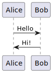

# Quality

Simple code is higher quality. Complex code is lower quality. Complexity reduces maintainability, extendability, and understandability.

Code that is seperable tends to be simpler. That means layers and reasons to have those layers. The standard web application layers are:

- Presentation
- API or entry points
- Application or service layer
- Domain or business logic
- Data access or adapters
- Database or persistance

## Diagrams

If I have Java, I can use plantuml.

First install. On homebrew:

```bash
brew install plantuml
```

Then, I can embed it like this:

<!--
@startuml firstDiagram

Alice -> Bob: Hello
Bob -> Alice: Hi!
	
@enduml
-->



Then, generate the diagram:

```bash
plantuml -tsvg testing/quality.md
```

Finally, push to Github and the diagram is ready.
